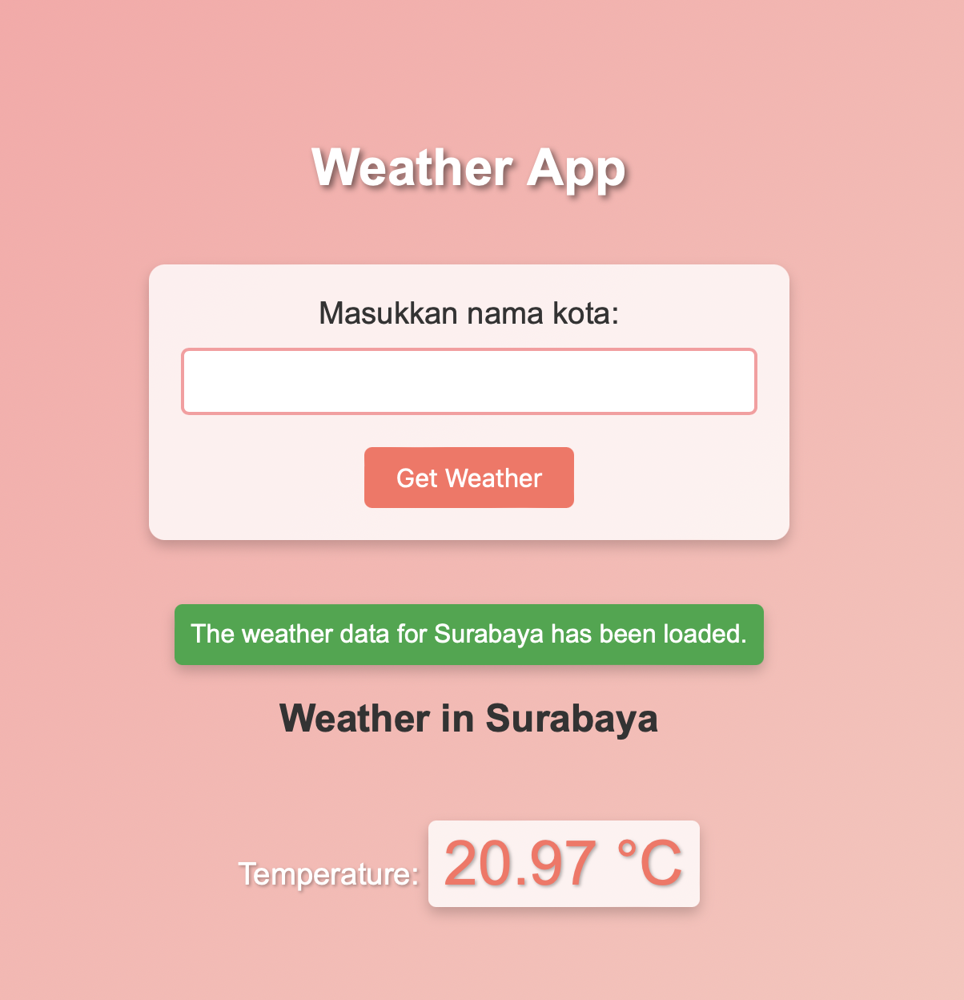

## Weather API

how to use?
first, you must create an account in https://openweathermap.org/api
then, in profile copy your API KEY. 
make apiConfig.json file, then inside that write :

```
{
    "OpenWeatherMapApiKey":"your_API_KEY"
}
```

after that, you can run your weather api with

```
go run main.go
```

then, open **http://localhost:8000/weather**

the page should display as follows

<a href ="" target="blank"> </a>
